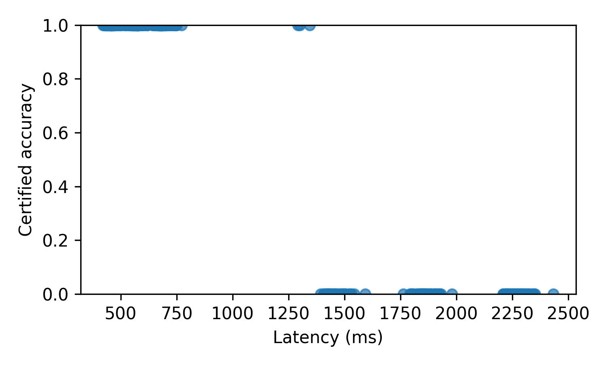
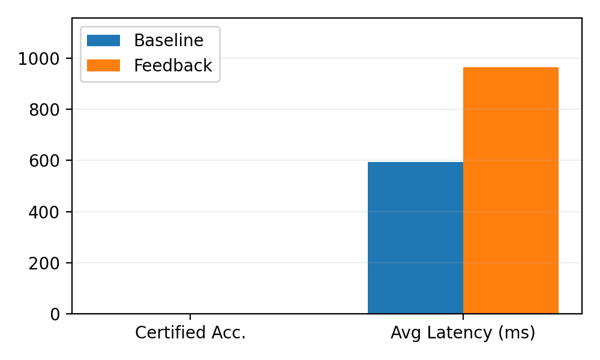

# LLM + SMT Verifiable Reasoning (CEGVR)

LLM‑guided, counterexample‑grounded verifiable reasoning: a local LLM proposes
solutions; an SMT solver (Z3) verifies and returns unsat‑core hints; the LLM
uses those hints to iteratively revise proposals. The toolkit includes
converters for SMT‑LIB and a MiniZinc subset, an evaluation harness with
ablations, and paper‑ready assets (tables/figures/LaTeX PDF).

PDF (camera‑ready): `examples/paper_assets/latex/main.pdf`

– Python 3.11 • Z3 • llama.cpp • Reproducible scripts

## Key Findings

- Unsat‑core feedback είναι διαθέσιμο ως φυσικές «υποδείξεις» που μπαίνουν στο επόμενο prompt του LLM.
- Σε 500 γραμμικά προβλήματα (σφιχτό budget) η επίδοση πιστοποίησης είναι συγκρίσιμη με one‑shot baseline· το latency ανεβαίνει προβλέψιμα με iterations. Η ροή γενικεύει σε MiniZinc subset και μικρά CSPs (π.χ. Sudoku).
- Πλήρως αναπαραγώγιμο: ένα script παράγει αποτελέσματα, σχήματα και το LaTeX PDF.

## Quickstart

```bash
git clone https://github.com/your-org/cegvr.git
cd cegvr
make install
```

Once installed, explore the CLI:

```bash
cegvr --help
cegvr show-config
cegvr init --copy-to my-config.yaml
```

## One‑Command Paper Repro

Run the full paper pipeline, from installation through LaTeX assets, with a single command:

```bash
bash scripts/run_all.sh
```

- `--seeds` (default `3`), `--max-rounds` (default `5`), `--budget` (default `2`), and `--timeout-ms` (default `2000`) control evaluation breadth.
- `--skip-tests`, `--skip-ablations`, `--skip-robustness`, and `--skip-latex` toggle individual phases.
- `--clean` clears all prior `runs/`, `tables/`, paper assets, and reports before executing.
- `--venv <path>` selects the virtual environment directory (default `.venv`).

If a local llama.cpp server is running at `http://127.0.0.1:8000` (see below),
the pipeline also evaluates the linear dataset with an LLM‑backed generator that
uses SMT feedback (unsat cores) to refine suggestions across rounds. When the
server is not available, a stub generator is used as a fallback.

The workflow produces:

- `runs/` with `toy`, `nosolver`, `nogrammar`, `norepair`, `_combined`, and `robust` results
- `runs/linear_llm_llm` (if llama.cpp is available) or `runs/linear` (stub fallback)
- `tables/main_results.csv` and `tables/linear/main_results.csv`
- `examples/paper_assets/tables/`, `examples/paper_assets/figures*/` for figures/tables
- `examples/paper_assets/latex/main.pdf` (compiled report)

Manual equivalent steps for reference:

1. `python3 -m venv .venv && source .venv/bin/activate`
2. `make install && pre-commit install`
3. `make test && make cov` (optional via `--skip-tests`)
4. `cegvr data-stats`, `cegvr gen-toy`, and the suite of `cegvr eval` / `summarize` commands
5. `cegvr make-tables`, `cegvr make-figures`, `cegvr export-cases`, and `make -C examples/paper_assets/latex`

### Docker Shortcut (optional)

```bash
docker build -t cegvr:latest .
docker run -it --rm -v "$PWD":/workspace cegvr:latest bash -lc './scripts/run_all.sh --skip-latex'
```

## LLM Server (llama.cpp)

Run a local llama.cpp server with a quantised model (e.g., Llama 3 8B Instruct):

```
./build/bin/llama-server \
  -m ~/models/Meta-Llama-3-8B-Instruct.Q4_K_M.gguf \
  --port 8000 --ctx-size 4096 --threads 8 --gpu-layers 35
```

The CLI auto‑detects `http://127.0.0.1:8000/v1/chat/completions` and uses the
LLM generator for linear/scheduling/Sudoku evaluations.

## Reproducible Environment

### Docker

A `Dockerfile` is provided for a consistent Python 3.11 environment. From the
repository root:

```bash
docker build -t cegvr:latest .
docker run -it --rm -v "$(pwd)":/workspace cegvr:latest bash
```

Inside the container you can run `scripts/repro.sh` to install dependencies,
execute the full test suite, run the toy evaluation, and regenerate the paper
figures/tables.

### VS Code Dev Container

Opening the repository in VS Code with the Dev Containers extension will use
`.devcontainer/devcontainer.json` to build the same image and automatically run
`scripts/repro.sh` after creation.

### One‑Click Reproduction

For local environments, execute:

```bash
./scripts/repro.sh
```

This command upgrades `pip`, installs the project in editable mode, runs the
test suite, executes the toy evaluation (`cegvr eval ...`), and regenerates the
figures/tables under `examples/paper_assets/`.

## Datasets & Converters

- SMT‑LIB (linear): `scripts/convert_linear_smt.py`
  - Example: `python scripts/convert_linear_smt.py --archive ~/datasets/linear_smt.zip --output data/linear/problems.jsonl`
- MiniZinc subset (scheduling): `scripts/convert_minizinc_scheduling.py`
  - Example: `python scripts/convert_minizinc_scheduling.py --archive ~/datasets/scheduling_mzn.zip --output data/scheduling/problems.jsonl`
- Sudoku 4×4: `scripts/generate_sudoku4.py` → `data/sudoku4/problems.jsonl`
- Latin square 5×5: `scripts/generate_latin5.py` → `data/latin5/problems.jsonl`

## Configuration

Configurations live in YAML files validated by Pydantic models. The bundled
`configs/default.yaml` file references the toy dataset in `data/toy/budget.csv`
and demonstrates the available fields. Use `cegvr init` to copy the default file
into a working directory and customise it for your experiments.

## Datasets

### Toy set

The repository ships with lightweight JSONL problems under `data/toy/problems.jsonl`.
Each line is a JSON object with fields like `problem_id`, `task` (one of
`math`, `scheduling`, or `planning`), `variables`, `constraints`, and an optional
`ground_truth` label. Use `cegvr data-stats --path data/toy/problems.jsonl` to view
basic counts per task. To add larger offline datasets, create a new JSONL file
following the same schema and point the CLI to it via the `--path` option. More
realistic sources can embed additional metadata; the loaders preserve unknown keys
under a `metadata` section for downstream use.

### Linear feasibility set

`scripts/build_linear_dataset.py` synthesises a larger collection of linear
inequality feasibility problems and writes them to `data/linear/problems.jsonl`
by default. Instances labelled `sat` are deliberately easy for the bundled
stub generator (any assignment inside the declared bounds works), while
`unsat` instances demand an unattainable aggregate sum. Regenerate or tailor
the dataset with, for example:

```bash
. .venv/bin/activate
python scripts/build_linear_dataset.py --total 500 --sat-ratio 0.7 --seed 123
```

The pytest suite validates a sample of satisfiable and unsatisfiable problems
to guarantee solver behaviour on the generated corpus.

## Evaluate (selected recipes)

- Linear (LLM feedback vs baseline):
  - Feedback (3 rounds):
    `cegvr eval --problems data/linear/problems.jsonl --out runs/linear_llm_llm --generator llm --llm-endpoint http://127.0.0.1:8000/v1/chat/completions --llm-model llama-3-8b-instruct --seeds 1 --max-rounds 3 --budget 1 --timeout-ms 1500`
  - Baseline (1 round):
    `cegvr eval --problems data/linear/problems.jsonl --out runs/linear_llm_baseline --generator llm --llm-endpoint http://127.0.0.1:8000/v1/chat/completions --llm-model llama-3-8b-instruct --seeds 1 --max-rounds 1 --budget 1 --timeout-ms 1500`

- Scheduling (MiniZinc subset, LLM):
  `cegvr eval --problems data/scheduling/problems.jsonl --out runs/scheduling_llm_llm --generator llm --llm-endpoint http://127.0.0.1:8000/v1/chat/completions --llm-model llama-3-8b-instruct`

- Sudoku 4×4 (LLM):
  `cegvr eval --problems data/sudoku4/problems.jsonl --out runs/sudoku4_llm_feedback --generator llm-sudoku --llm-endpoint http://127.0.0.1:8000/v1/chat/completions --llm-model llama-3-8b-instruct --seeds 1 --max-rounds 3 --budget 1 --timeout-ms 1500`

## Results Snapshot

Linear (latency vs accuracy):



Linear (baseline vs feedback):



The full report with tables and figures is compiled at:

- `examples/paper_assets/latex/main.pdf`

## Reasoning Trace Schema Example

Reasoning traces are expressed as structured JSON documents that conform to
`src/cegvr/grammar/schema.json`. A minimal example demonstrating variables,
steps, and constraints is shown below:

```json
{
  "problem_id": "demo-problem",
  "task": "math",
  "variables": [
    {"name": "x", "domain": "int", "bounds": {"lower": 0, "upper": 10}},
    {"name": "flag", "domain": "bool"}
  ],
  "assumptions": ["x >= 0"],
  "steps": [
    {
      "id": 1,
      "kind": "assume",
      "expr": {
        "type": "binary",
        "op": "<=",
        "left": {"type": "variable", "name": "x"},
        "right": {"type": "constant", "value": 10}
      }
    }
  ],
  "constraints": [
    {
      "kind": "linear_ineq",
      "terms": [{"variable": "x", "coefficient": 1.0}],
      "relation": "<=",
      "rhs": 10
    }
  ]
}
```

## Development

This repository includes a `Makefile` for common workflows:

- `make lint` – run Ruff for linting.
- `make format` – run Black to apply the formatting rules.
- `make typecheck` – validate type hints with mypy.
- `make test` – execute the pytest suite (see `tests/test_smoke.py`).
- `make cov` – run tests with coverage reporting.

Automated checks are wired through GitHub Actions (`.github/workflows/ci.yml`)
and a `.pre-commit-config.yaml` is provided for local tooling.

## Troubleshooting

- **ValidationError** – indicates malformed traces or problem specs. Run
  `cegvr data-stats` to ensure datasets are well-formed, or inspect a failing
  record with `cegvr explain --problem-id <id> --from runs/toy/results.jsonl`.
- **SolverTimeout** – the SMT backend exceeded the timeout. Increase
  `--timeout-ms` or reduce problem complexity. Baseline mode (`--no-solver`)
  can be used to debug generation issues without SMT.
- **SolverUnknown** – Z3 returned `unknown`. Re-run with increased timeout or
  inspect the unsat core/trace via `cegvr explain` to simplify constraints.
- **GenerationError / NoCoverage** – the trace generator produced no viable
  candidates. Check the input problem definitions and adjust repair budgets or
  generator hints.

## License

This project is licensed under the MIT License. See `LICENSE` for details.
