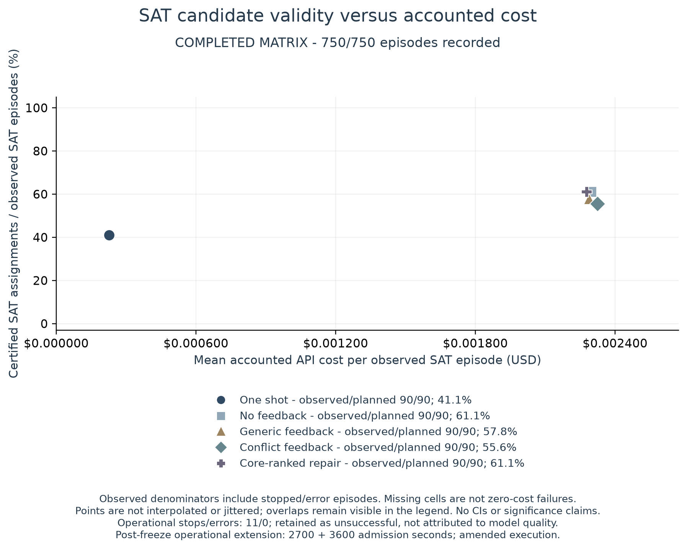

# CEGVR — LLM candidates with SMT verification

**[Live formal-verifier demo](https://stelioszach.com/demos/smt-verify/)** · **[Recorded pilot and raw evidence](artifacts/openrouter-pilot-v1/README.md)** · [Deployed adapter/UI source](https://github.com/stelioszach03/stelioszach-portfolio/tree/main/demo-services/smt-verify)

A completed research prototype that asks whether solver feedback helps a language model produce valid assignments for formal constraint problems. A generator proposes candidates, Z3 checks the original constraints, and a bounded repair loop may return feedback. The public demo verifies supplied candidates without paid language-model generation.

## Measured result

The September 24, 2026 pilot contains **750 recorded task/seed/arm cells: 739 completed executions and 11 deadline stops**, across 50 public synthetic problems, three requested seeds and five arms. All prior outcomes and transport failures are retained. This is not the previously proposed 500 × 3 × 5 full study.

| Arm | Valid SAT assignments / 90 | Solver-certified UNSAT claims / 60 |
|---|---:|---:|
| One shot | 37 | 59 |
| Repeated generation without feedback | 55 | 60 |
| Generic feedback | 52 | 60 |
| Conflict feedback | 50 | 60 |
| Core-ranked repair | 55 | 60 |

Core-ranked repair has **no observed SAT certification-rate advantage over repeated generation without feedback** in this pilot: six paired wins each, 78 ties. This is not a statistical-equivalence claim. Direct Z3 solved all 500 formal source problems without model calls. The evidence does not establish practical value over direct solving on these already formalized inputs; this remains a supporting experimental snapshot rather than a headline research result.

The accounted API total is **$0.867535**, including known micro-dollar rounding and reserves for five calls with unknown usage. There are **4,453 HTTP attempts** and **8,482,490 known tokens**; the complete token total remains unknown. The [report](artifacts/openrouter-pilot-v1/README.md) separates measured cost, uncertainty, operational stops and all generated-but-unused candidates.



## Scope and limits

- One hosted GPT-OSS-20B provider/quantization, 50 already-public synthetic problems and three requested seeds. This is not an unseen benchmark, a broad reasoning evaluation, model training or a peer-reviewed publication.
- SAT candidates must satisfy every original constraint and domain condition. An UNSAT claim is checked by Z3; it is not an LLM-produced proof. Formal verification does not establish that a natural-language problem was encoded correctly.
- Primary feedback withholds full solver SAT witnesses. A separate legacy oracle-copy control demonstrates why giving the model a completed witness would confound a repair claim.
- Every paid batch response is counted, including unused candidates. One-shot is a lower-budget reference; equal multi-round caps are not measured equal costs. Operational stops are included in observed certification rates and are not attributed solely to model quality.
- The original protocol was published before inference. A [published operational extension](docs/studies/OPENROUTER_PILOT1_AMENDMENT.md) completed unlaunched cells after the first admission deadline; it retained the same model, source and cumulative $3 cap. The original stopping schedule was amended explicitly, with no retry of existing failed/stopped episodes.
- No full 7,500-episode sweep was run. Legacy unsupported figures and manuscript PDF remain absent; historical Git commits are preserved. The live verifier is maintained separately in the portfolio repository.

## Offline checks and evidence replay

```sh
python3.11 -m venv .venv
source .venv/bin/activate
python -m pip install -e '.[dev]'
python -m pytest -q
cegvr eval --problems data/toy/problems.jsonl --out runs/toy \
  --seeds 1 --max-rounds 3 --budget 2 --timeout-ms 1500 --generator stub
```

The stub tests software plumbing, not model ability. To inspect actual model behavior, download the [immutable release archive](https://github.com/stelioszach03/llm-smt-verifiable-reasoning/releases/tag/openrouter-pilot-v1), verify its SHA-256 and follow the [offline analysis commands](artifacts/openrouter-pilot-v1/README.md#raw-archive-and-offline-replay). No API key is needed to reproduce tables and figures.

The repository also retains the candidate/trace pipelines, five comparison arms, a 500-problem synthetic source dataset, small CSP examples and bounded operator scripts. Only the candidate-first pipeline under the recorded settings was evaluated here. Legacy CLI model strings are configuration defaults, not evidence of a loaded model; `scripts/run_all.sh` is a larger planned workflow and must not be treated as completed evidence.

[MIT license](LICENSE).
